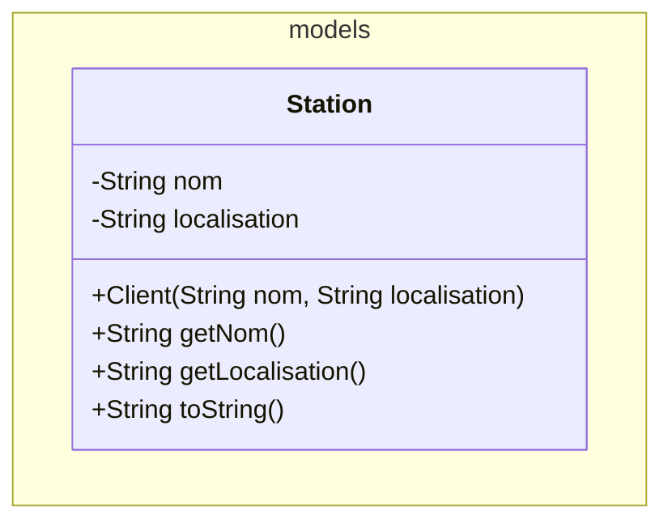
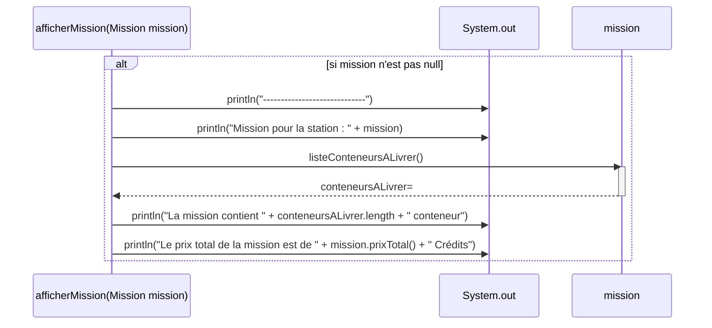

## F18 - Galatic Exploration

### Contexte général
L'entreprise GalacticExploration envoie régulièrement des modules de ravitaillement à ses stations spatiales.

Les modules sont transportés et livrés dans des conteneurs spatiaux pouvant accueillir au maximum 8 modules.


Ces conteneurs spatiaux :
- facilitent grandement le stockage des modules dans le vaisseau de transport.
- permettent de facilement identifier la station à livrer grâce à une étiquette directement sur le conteneur.
- facilitent grandement les livraisons et surtout leur portage.

**ATTENTION**  
Commencez par lire cette consigne avec grande attention et prenez garde :
- Les descriptions fonctionnelles sont précises et le choix des mots n'est pas anodin.
- Faites les points mentionnés avec précision et dans l'ordre indiqué.
- Revérifiez bien ensuite avoir fait ce qui est demandé.

### CONSIGNE

**Modules**  
Dans le package `models`, créez une classe nommée `Module`. Un `Module` aura les caractéristiques suivantes : `nom` (genre "Oxygène", "Nourriture", "Pièces détachées"), `prix` (genre 5000.00), `poids` (pour son poids en kilogrammes), `volume` (en mètres cubes), et `état` (pour savoir si celui-ci est en bon état ou endommagé).

Toutes ces informations doivent être fournies lors de sa création sauf `état` dont on connaît d'avance l'état initial (bon état).

On doit pouvoir demander toutes ces informations à un module. Aucune de ces informations ne devra pouvoir être modifiée après coup sauf pour l'état (car un module peut être endommagé durant le transport).

Si on affiche un module, celui-ci doit se montrer sous cette forme "Module 'Oxygène' de 2.5m³ à 5000.00 Crédits - en bon état" ou encore "Module 'Nourriture' de 1.0m³ à 3000.00 Crédits - endommagé". Les montants en crédits doivent y être affichés sur deux positions (c-à-d 5000.00 Crédits et non pas 5000 Crédits).

**Conteneurs**  
Toujours dans le package `models`, créez une classe nommée `Conteneur` pouvant accueillir un certain nombre de modules et ayant un identifiant textuel unique du genre "C73V9".

Pour créer un nouveau conteneur, la seule information à fournir sera son identifiant unique. Concernant le nombre de modules que le conteneur pourra contenir, faites en sorte que ce nombre de modules soit fixé à 8. De même, faites en sorte qu'aussitôt créé un conteneur soit vide (= ne contienne pas de modules).

Une fois un conteneur créé on ne pourra plus modifier son identifiant mais par contre on pourra toujours le consulter.

On doit pouvoir lui donner l'ordre de ranger un module qui sera stocké uniquement s'il reste encore de la place pour celui-ci.

De même, on doit pouvoir lui prendre un module si celui-ci s'y trouve bien.

On doit pouvoir demander à un conteneur le nombre de modules stockés ainsi que le nombre de places encore disponibles.

On doit aussi pouvoir lui demander la liste des modules actuellement stockés.

Et, pour terminer, on doit pouvoir lui demander son prix total, c-à-d la somme du prix de chacun des modules qui y sont stockés.

L'affichage d'un conteneur doit montrer ceci "Conteneur 'C73V9' avec X/Y modules" (avec X étant le nombre de modules stockés et Y le nombre de places encore disponibles). Tant X que Y doivent y être affichés sur deux positions (par exemple "Conteneur 'C73V9' avec 02/08 modules").

**Stations**  
Dans le bon package, vous allez créer une classe permettant de modéliser une station spatiale. Les informations utiles pour correctement définir cette classe sont données ci-dessous en UML :



À noter que l'affichage d'une station devra montrer ceci "Station ORION - Orbite de Mars" (le nom de la station devra être mis en majuscules).

**Missions**  
Toujours dans le package `models`, créez une classe permettant de modéliser une mission. Une mission concerne une seule station qui doit être fournie lors de sa création et ne pourra plus être modifiée ensuite, mais on doit pouvoir la demander.

Une mission doit savoir tenter de rajouter un conteneur respectivement supprimer un conteneur d'elle-même. Comme il n'est pas possible de livrer des missions de plus de 5 conteneurs, faites en sorte qu'on ne puisse pas dépasser ces limites lors du rajout ou suppression d'un conteneur.

Une mission doit pouvoir être annulée, c-à-d que tous ses conteneurs seront supprimés.

Au besoin, on doit pouvoir demander à une mission la liste exacte des conteneurs qu'il faudra livrer.

De même, on doit pouvoir demander à une mission son prix total.

**Application**

**Méthode - void afficherMission(Mission mission)**  
Le code de cette méthode est directement fourni ci-dessous via un diagramme de séquence UML :



**Méthode - void main(String[] args)**  
Dans le `main()` de la classe `Application` déjà fournie, effectuez les opérations suivantes :
- Dans un tableau de 5 missions, placez les deux missions prévues (voir le détail ci-dessus)
- Ensuite, pour chaque mission présente dans votre tableau, appelez tout simplement la méthode `afficherMission()` afin de l'afficher.

Voici la transformation de l'information en tableau:

| Mission | Station                     | Conteneur 1                           | Conteneur 2                           | Conteneur 3                           |
|---------|-----------------------------|---------------------------------------|---------------------------------------|---------------------------------------|
| 1       | ORION - Orbite de Mars      | Identifiant = "C73V9"                 | Identifiant = "C73V10"                | Identifiant = "C73V11"                |
|         |                             | 4x 'Oxygène' de 2.5m³ à 5000.00 Crédits | 2x 'Pièces détachées' de 3.0m³ à 7000.00 Crédits | 1x 'Oxygène' de 2.5m³ à 5000.00 Crédits |
|         |                             | 4x 'Nourriture' de 1.0m³ à 3000.00 Crédits |                                       | 1x 'Nourriture' de 1.0m³ à 3000.00 Crédits |
| 2       | ANDROMEDA - Orbite de Jupiter | Identifiant = "C73V12"               |                                       |                                       |
|         |                             | 2x 'Oxygène' de 2.5m³ à 5000.00 Crédits |                                       |                                       |
|         |                             | 1x 'Nourriture' de 1.0m³ à 3000.00 Crédits |                                       |                                       |

### Résultat sur la console

Si vous avez correctement réalisé cette application vous devriez obtenir un affichage ressemblant à ceci :

```
-------------------------------------------------------------
Mission pour la station : Station ORION - Orbite de Mars
La mission contient 3 conteneurs
Le prix total de la mission est de 23'000.00 Crédits
-------------------------------------------------------------
Mission pour la station : Station ANDROMEDA - Orbite de Jupiter
La mission contient 1 conteneur
Le prix total de la mission est de 8'000.00 Crédits
```

## Fonctionnalités supplémentaires
Une fois tout ce qui précède réalisé et fonctionnel, ajoutiez ces capacités à vos classes ´Mission´ et ´Conteneur´:

### Conteneur :
- **Obtenir le nombre de modules d'une taille précise** : on doit pouvoir demander à un conteneur le nombre de modules d'une taille précise en m³. Si aucun conteneur n'est trouvé avec cette taille, on obtiendra -1.
- **Calcul du volume globale** : on doit pouvoir demander à un conteneur le volume globale en m³. On obtiendra le volume globale du conteneur.

### Mission
- **Calcul le prix moyen des conteneurs livrés** : on doit pouvoir demander à une Mission la coût moyen d'un conteneur. On obtiendra le coût en crédit.
- **Supprimer les modules d'un certains types** : on doit pouvoir demander à une Mission de supprimer les modules contenant par exemple de l'"Oxygène". On obtiendra le nombre de module supprimé.

## RESTITUTION
Rendez votre travail par push GitHub.  

